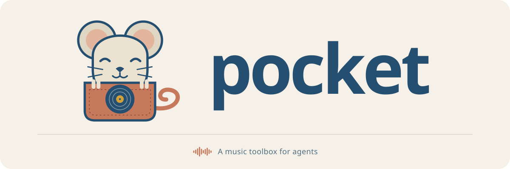

<p align="center"></p>

<p align="center"><strong>The musical toolkit for agents.</strong><br>
Composable tools for recordings, MIDI and arrangements. Use them from Python, the command line or an AI agent.</p>

<p align="center">
<a href="https://github.com/rpalermodrums/pocket/actions/workflows/tests.yml"></a>
<a href="LICENSE"></a>

</p>

<p align="center">
<a href="https://rpalermodrums.github.io/pocket/">Website</a> ·
<a href="docs/getting-started.md">Your first experiment</a> ·
<a href="docs/concepts.md">Key ideas</a> ·
<a href="docs/agents.md">Use with an agent</a> ·
<a href="docs/README.md">All guides</a>
</p>

---

Musicians talk about playing *in the pocket*: locked into the time, where
everything feels right. Pocket is a set of tools built to be just as exact about
time. It keeps track of which recording you mean, which clock a position
belongs to, and who said what about the result.

Each tool does one small job, shows its evidence and leaves your originals
untouched. You and your agent decide what to build with them.

Pocket is open source and in early development.

## Why Pocket

- **A recording is its bytes.** Audio is identified by its exact content, not
  by its title or filename, so one master never quietly becomes another.
- **Every clock has a name.** Sample positions in a file, beats on a timeline,
  the pulse you tap and the bar one you count are kept apart. Converting
  between them is always explicit.
- **Evidence keeps its label.** Measurements, a model's guesses, authored
  decisions and a person's listening reports are separate records, and
  disagreements stay visible.
- **Nothing is overwritten.** Every edit is a new version with its lineage.
  Your recordings, projects and earlier trials stay exactly as they were.

## Quick start

With Python 3.11 or later:

```sh
git clone https://github.com/rpalermodrums/pocket.git && cd pocket
python3 -m venv .venv && source .venv/bin/activate
python -m pip install -e .
python examples/practice_context.py private/first-practice
pocket context-resolve --spec private/first-practice/resolve-spec.json
```

Pocket makes a short test recording, repeats two passages, renders an
alternative and works out exactly where a cue lands on the second pass
(`{"n": 5, "d": 2}`, or 5/2 quarter notes). No DAW, model, login or download is
needed. [Your first experiment](docs/getting-started.md) walks through every
step.

## The toolkit

| Tool | What it's for | Needs |
|---|---|---|
| [Musical context and practice](docs/musical-context.md) | Mark passages and cues, render exact alternatives, compare them | Nothing extra |
| [Practice review](docs/practice-review.md) | Listen in your browser and save what you heard, pinned to the exact audio | macOS or Linux |
| [Peek](docs/peek.md) | Look inside a recording: attacks, pulse candidates, tempo drift, tonal hints | Nothing extra |
| [MIDI and sound tools](docs/midi.md) | Create, edit, structure and export MIDI with explicit timing and locks | `midi` extra for files |
| [Thread](docs/thread.md) | Follow the clips and sources through a saved Ableton Live set | A saved `.als` |
| [Stitch](docs/stitch.md) | Compare exact renders of a transition, with notes on what you heard | Rendered audio |
| [Baste](docs/baste.md) | Take a read-only look at the Live session that's open right now | Live 12 Suite, macOS |
| [Pipette](docs/pipette.md) | Carry one kept trial into a new project without disturbing the original | A Stitch trial |
| [Weave](docs/weave.md) | Sketch several possible orders for a crate of records | A [record bag](docs/record-bag.md) |
| [Whisker](docs/whisker.md) | Propose what could come next, in a session you share with an agent | A record bag |

The names come from the pocket itself: it's sewn with thread and stitches, and
Pip, the field mouse who lives in it, peeks out and feels the way with
whiskers.

## Use it with an agent

```sh
python -m pip install -e '.[agent]'
```

`pocket-mcp` offers every tool to an MCP-capable AI assistant. It runs locally
over standard input and output, so nothing is hosted and no audio is uploaded.
Point your client at the executable in your virtual environment, then give
your agent [the Pocket skill](skills/pocket/SKILL.md). The
[agent guide](docs/agents.md) covers the setup, first requests to try and what
an agent can and can't do.

Python, the `pocket` command and MCP all call the same functions, so a result
never depends on the interface. [Contracts and errors](docs/contracts.md)
describes discovery, input schemas and machine-readable errors.

## Optional extras

```sh
python -m pip install -e '.[midi]'            # MIDI file import and export
python -m pip install -e '.[agent]'           # the MCP server
python -m pip install -e '.[agent,dev,midi]'  # everything the test suite needs
```

Core workflows run entirely on your machine. The optional acquisition, Spotify
and model adapters each have their own explicit setup and network behavior, and
none of them runs unless you ask for it. Give Pocket access only to the files
you intend it to work with, and keep recordings, credentials and listening notes
out of Git.

## Where it's heading

Pocket isn't exclusive to any one genre, instrument, or DAW. After
version 1, the aim is a responsive, living "band in a box": a practice partner
that follows the form, comps, trades and adjusts to you, with jazz as an
important proving ground. That needs its own real-time and musical evaluation.
[Status and direction](docs/status.md) separates what exists today from what's
planned.

## Project

- [Contributing](CONTRIBUTING.md): development setup and the rules that keep
  the evidence honest
- [Code of conduct](CODE_OF_CONDUCT.md)
- [Security](SECURITY.md): report vulnerabilities privately
- [Changelog](CHANGELOG.md)

Pocket is released under the [MIT License](LICENSE). Bundled third-party code
keeps its own license notices. The repository license grants no rights to
recordings, models or other independently sourced material.
