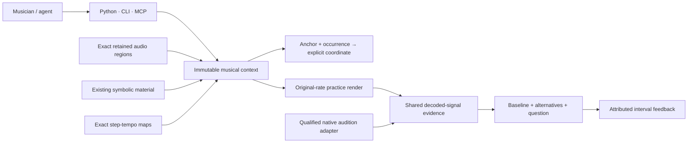

# Musical context and standalone practice

Pocket is a composable toolkit for musical work across recordings, instruments,
notation, practice, performance and hosts. The post-v1 goal includes a responsive
“living band in a box”: a practice partner that can listen, follow musical form,
respond and adapt with a musician. Jazz is an important proving ground; a DAW,
genre, fixed meter or electronic production workflow is not a core requirement.

This implementation supplies a small foundation for that goal. It binds retained
recordings, symbolic material, declared clocks, internal musical anchors and
individual occurrences in an immutable context. A standalone practice profile
can render exact passages and repetitions, compare alternatives, and retain
attributed feedback. It does not implement live accompaniment or musical inference.

## The boundary that matters



The context owns identity and authored relationships. The existing time provider
owns step-tempo integration and meter display. The practice renderer owns its
limited audio realization. Shared evidence code owns signal measurement and
feedback validation. Native candidate preparation, Live XML, export reports and
native promotion stay in their adapter.

## Records and coordinates

| Record | Meaning |
|---|---|
| `pocket.musical-context/v1` | Immutable definition, optional exact parent, declared coverage. This is distinct from both the selection browser's `pocket.workspace/v1` and native `pocket.context/v1`. |
| Source clock | A local clock ID bound to a verified retained audio region. Positions use **absolute original recording frames**, including the nonzero capture offset. The source's byte hash remains its recording identity. |
| Timeline clock | A local clock ID bound to an existing `pocket.time-map/v1`. Quarter notes, host seconds and identified render frames retain that map's exact conversion rules. A standalone timeline needs no host process. |
| Occurrence | Explicit ID, source clock, timeline clock, source frame interval and timeline quarter-note interval. The mapping between its endpoints is affine and authored. Repeated passages have distinct occurrence IDs. |
| Anchor | A named point, its kind, clock position and attributed interpretation with uncertainty. Pulse, bar one, phrase start and onset remain distinct. An anchor does not rewrite a tempo or meter map. |
| Material reference | An existing validated `pocket.material/v1` handle. Existing MIDI material semantics are preserved; context membership does not create audio or a placement. |
| `pocket.practice-render/v1` | Context revision, selected occurrences, original-source/output mappings, exact output audio handle, processing profile and measured signal. |
| `pocket.practice-comparison/v1` | Explicit baseline, alternatives, question, duration policy and signal readiness. No inferred winner. |
| `pocket.practice-feedback/v1` | Exact comparison/render, audio hash, frame interval, actor, actor kind, note and optional decision. |
| `pocket.practice-preview/v1` | Declared PCM16 browser copy of one exact render: parent and audio identities, one-to-one frame mapping, conversion, quantization error and signal evidence. |

Every position is scoped by the **context artifact handle plus clock ID**. Local
IDs alone are not durable cross-context references. An immutable child context
can retain a parent handle; this is lineage, not a shared mutable head or lock.
Two edits can intentionally branch. A future interactive editor will need its
own revision-checked head/session adapter.

Rationals are reduced `{ "n": numerator, "d": denominator }` values, with positive
denominators and bounded integers. No decimal approximation is introduced for
source frames. Source and output audio intervals are end-exclusive. A conversion
may address the final boundary as a point; an adjacent occurrence at that boundary
can therefore require an explicit occurrence ID.

### An internal downbeat in a repeated passage

Suppose a recording was captured starting at frame 700. The selected passage is
original frames `[1700, 9700)`, and its authored internal anchor is frame 3700.
At 8 kHz the anchor is 0.25 seconds into that passage. In a 120 BPM timeline:

| Occurrence | Timeline interval | Anchor position |
|---|---|---|
| `first` | `[0, 2)` quarter notes | `1/2` quarter note |
| `again` | `[2, 4)` quarter notes | `5/2` quarter notes |

Resolving that source anchor without an occurrence fails as ambiguous. The
capture start, passage start and anchor are three different positions. The
provider verifies the mapping; the author's assertion that the point is beat one
remains an interpretation.

## Public contract

The providers are lazy root exports from `pocket_music`. MCP uses the same
underscore names. CLI uses hyphens and accepts the same argument object through
`--spec path.json`. The existing `PUBLIC_CAPABILITIES` registry registers all three
surfaces; there is no additional HTTP implementation.

An already-running Pocket MCP process needs a restart to load the new provider
registrations. Existing editable installations pick up the Python/CLI changes.

| Provider | Required inputs beyond `store_root` | Result |
|---|---|---|
| `context_create` | `request_id`, `definition`; optional `parent` | New immutable context handle. |
| `context_query` | `context`; optional `section`, `offset`, `limit` | Summary or bounded sources, timelines, occurrences, anchors, materials. |
| `context_resolve` | `context`, `target_clock_id`, `target_space`, exactly one `position` or `anchor_id`; optional `occurrence_id` | Exact output coordinate and the occurrence used. |
| `practice_render` | `request_id`, `context`, ordered `occurrence_ids` | New audio and render handles with source mappings. |
| `practice_compare` | `request_id`, `baseline`, `variants`, `question`; optional `allow_duration_mismatch` | Verified comparison handle. |
| `practice_feedback` | `request_id`, `comparison`, `render`, `interval_frames`, `actor`, `actor_kind`, `note`; optional `decision` | Attributed feedback handle. |
| `interpretation_create`, `interpretation_query`, `context_bind_interpretation` | Exact context/source clock, tagged claim, attribution; selected evidence when applicable | Immutable interpretation and v2 context binding. |
| `context_edit`, `context_edit_query` | Explicit operations, locks, attribution or exact edit handle | Child context and revalidated preservation proof. |
| `practice_compare_revisions` | Baseline/variants, edit receipts, full occurrence correspondence, question | Explicit cross-revision comparison. |
| `practice_feedback_query` | Explicit feedback handles; optional exact render, interval and report filters | Bounded original reports without consensus. |
| `practice_envelope`, `practice_compare_processed` | Exact baseline, declared joins and attribution; or derivatives and question | Explicit processing and baseline comparison. |
| `practice_preview` | `request_id`, exact `render` (raw or join envelope), `profile: "browser-pcm16-original-rate/v1"` | Declared PCM16 browser preview and its audio handle. |
| `practice_query` | `artifact`; optional `section`, `offset`, `limit` | Revalidated render/comparison/feedback/preview summary, or paged render mappings. |

`MusicalContextDefinition` and nested transport types live in `context_types.py`.
All definition fields are explicit: `context_id`, `title`, `attribution`, `sources`,
`timelines`, `occurrences`, `anchors`, `materials`. Empty collections are allowed.
An attribution contains `actor`, `actor_kind` (`human`/`agent`), `statement` and
`uncertainty`. These are reported claims, not authenticated human identity.

Read calls take exact immutable handles. File-writing calls use the existing
request journal: identical inputs replay the verified result; changed inputs
under the same request ID fail with `idempotency_conflict`. A failed or interrupted
request is inspected before a new attempt; the provider never steals its lock.

New calls retain `pocket.operation-receipt/v1` and its existing `ok`, `failed`,
`unsupported`, etc. vocabulary. Their provenance explicitly names
`musical-context-v1`. Existing receipts retain their old provenance and fields.
Invalid calls raise `PocketError`; the current CLI returns structured errors with
exit code 2 and MCP returns tool errors. The proposed future facade's status and
error vocabulary has not been substituted for these working contracts.

## Run the complete example

Choose a new directory outside the repository:

```sh
python examples/practice_context.py /tmp/pocket-practice-demo
pocket context-resolve --spec /tmp/pocket-practice-demo/resolve-spec.json
```

The demo creates only synthetic audio, captures exact frames, declares a clock
and internal anchor, renders two passage/repetition alternatives, creates a
comparison and verifies it. It prints the two audio paths and writes
`results.json`. It deliberately records no listener report.

The Python equivalent of resolving the anchor is:

```python
from pocket_music import context_resolve

result = context_resolve(
    store_root=store,
    context=context_handle,
    anchor_id="internal-cue",
    occurrence_id="repeat",
    target_clock_id="practice",
    target_space="arrangement_qn",
)
```

When someone actually listens, call `practice_feedback` with that person's
attributed report, the exact render handle and the interval heard. Agent analysis
uses `actor_kind="agent"`. Creating feedback never changes a render's stored
`listening` field or invents consensus; the reports remain separate artifacts.

## Implemented profiles and limits

- Contexts: 32 source clocks, 32 timeline clocks, 32 material references, 256
  occurrences, 256 anchors, and at most 32 parent revisions. Query pages cap at 64.
- Conversion: exact step-tempo maps plus explicitly authored affine occurrences.
  Unsupported routes include source-to-source and cross-timeline inference,
  extrapolation and implicit frame rounding. Use the existing time-map provider
  directly for its explicitly declared render-frame quantization policy.
- Capture: existing exact PCM16/24 or finite FLOAT32 WAV profile, at most 20 seconds
  retained per region. Original bytes remain externally retained; their identity
  and the selected crop's exact mapping are kept.
- Rendering: 1–32 distinct occurrence IDs, one timeline, contiguous ordered
  intervals, matching sample rate, mono/stereo, at most 120 seconds and 64 MiB.
  The implementation checks every intersecting tempo step. A map may describe
  time stretch, but this renderer rejects it—even when total duration happens to
  match. Output uses DOUBLE WAV to preserve decoded source samples exactly.
- Comparisons: one baseline plus 1–8 distinct render handles from one exact
  context revision. Sample rate/channel layout must match. Unequal durations
  require explicit opt-in. Cross-revision edits use the explicit comparison profile described below.
- Signal readiness: decoded samples, duration, sample peak/RMS, overload and
  silence checks. No LUFS, true-peak, musical-quality or listening claim follows.
- Revalidation: source graphs, mapping and decoded output samples are rechecked.
  Moving the complete artifact store preserves references; retained practice
  reads do not need the original external recording. Recapturing/replaying the
  original capture request still validates that external original.

DOUBLE WAV is an evidence format and is not supported by every browser player.
Use `practice_preview` for a declared browser copy (see
[declared browser previews](#declared-browser-previews)). Earlier local
experiments used separate FLOAT32 review copies; those files are not a public
processing profile.

This profile does not mix overlapping layers, transpose, stretch, generate a
count-in, infer meter, or accompany a player in real time. Existing symbolic tools
remain composable through material references. Those additions need their own
capability profiles and evidence rather than broader claims attached to this one.

The [local-recording recipe](../examples/exercise_practice_recording.py) exercises
analysis abstention, competing pulse estimates and overloaded FLOAT32 audio.
Working plans and private acceptance reports live in the ignored local
[development material](README.md#local-development-material).

## Evidence-bound interpretations

`interpretation_create` binds a claim to an exact context and source clock. A
selected candidate names its `audio-region-hypotheses` handle, expected revision
and annotation ID. Wrong recordings/crops, stale revisions and superseded
candidates are refused. `interpretation_query` returns the selected evidence and
its original-source projection without rerunning a detector.

Claims are onset/bar-one/phrase-start points, pulse estimates, or unresolved
intervals. Selected claims preserve candidate values; authored claims remain
attributed choices. An attack cannot certify bar one. Abstention supports an
unresolved interval, never a guessed tempo. Fractional model positions remain
rational evidence; they are not silently rounded into source frames.

`context_bind_interpretation` creates an immutable `pocket.musical-context/v2`
child with a typed selection binding or a new point anchor. Point anchors require
integer source frames. A pulse/unresolved choice is retained as a selection and
does not change a tempo map. The interpretation must belong to the exact parent
context. Binding IDs are unique; bindings and context ancestry remain bounded.
Read them with `context_query(section="bindings")`.

V1 records and receipts remain readable with their original meaning. V2 adds a
`bindings` collection outside the definition. Ordinary create calls still produce
v1 contexts; they cannot downgrade a v2 parent and discard its bindings. Query,
resolve and exact practice rendering accept both versions. The same operation
names and closed nested types are exposed through Python, CLI and MCP.

## Literal context edits

`context_edit(context, operations, locks, attribution, ...)` returns a child
context and a `pocket.context-edit/v1` receipt. `context_edit_query` recomputes the
change and preservation proof from its exact parent; rehashing a false receipt
or an unrelated child does not make it valid.

- `occurrence_slip_source`: explicit `occurrence_ids` and integer `delta_frames`;
  source duration and timeline placement stay fixed.
- `occurrence_shift_timeline`: explicit `occurrence_ids` and rational `delta_qn`;
  source windows and duration stay fixed. A linked move names every occurrence.
- `anchor_rebind`: existing `anchor_id`, exact-parent `interpretation` and
  `binding_id`; replaces only that anchor's binding and retains other selections.

Each lock names `section` (`occurrences` or `anchors`), `object_id` and `fields`.
Unknown locks and any protected-field change fail. A field may change only once
per edit; duplicate linked IDs and zero-delta operations fail. The limits are 32
operations, 32 explicitly linked IDs per operation and 128 lock records.

The receipt lists changed paths, exact before/after values, and a preservation
hash for unchanged definition fields. Sources, time maps, material references,
untargeted objects and parent bytes remain unchanged. Each requested occurrence
group reports compatibility with the exact PCM renderer. A valid timing intent
may still need another render profile; no audio is created by a context edit.

## Compare across revisions

`practice_compare` retains its original same-context contract. Use
`practice_compare_revisions` for edited children. It requires the exact baseline
render, variant renders, verified `edit_receipts`, an explicit `correspondence`
for every variant, and a musical question. The new record family is
`pocket.practice-revision-comparison/v1`; it is not a relaxation of comparison v1.

Each correspondence pairs baseline/variant occurrence IDs and their full output
frame intervals. Every output occurrence must be covered exactly once. There is
no automatic alignment or implied phrase match. `duration_policy="equal"` checks
both total and paired durations; `"allow_mismatch"` explicitly permits differences.
The limits are eight variants, sixteen edit receipts and thirty-two pairs per
variant. Unrelated or missing ancestry, unused receipts and forged changes fail.

`practice_query` revalidates either comparison family. `practice_feedback` accepts
both and still binds a report to the exact render hash and interval. Signal flags,
unchanged baseline bytes and conflicting interpretations stay visible. Neither
creating a comparison nor reading feedback supplies a listening verdict.

## Retrieve scoped reports

`practice_feedback_query` takes 1–128 explicit feedback handles. Optional filters
include an exact `render` handle, `actor`, `actor_kind`, `decision` and
`interval_frames`; an interval requires the render handle. An audio hash alone
cannot distinguish identical PCM belonging to different context revisions.

Queries validate all supplied reports before filtering. Pages retain input order,
original intervals, text and contradictory decisions. An overlap match does not
extend a keep decision. Cursors bind the exact input/filter identities; changed
filters or reports invalidate them. Limits are 1–128 rows and 4–64 KiB per response.
An oversized report returns `needs_input` with a resumable cursor, without silently
truncating its note.

The shared selection/pagination implementation also serves native
`audition_feedback_query`; its existing fields and cursor behavior are preserved.
Native attachment validation and standalone render validation remain separate.

## Explicit join envelopes

`practice_envelope(store_root, request_id, render, joins, attribution)` makes a
new `pocket.practice-envelope/v1` derivative of an exact PCM render. Each join
specifies `boundary_frame`, `fade_out_frames`, `fade_in_frames`, and
`curve: "linear"`. The boundary must be an actual join between retained output
occurrences. It is not a detected beat, phrase boundary or clip-start assumption.

For three frames per side, gains across the join are `[1, 0.5, 0, 0, 0.5, 1]`.
One-frame sides are zero. Windows are ordered, nonoverlapping, in bounds, and at
most 250 ms per side; there are at most 32 joins. Rate, channels, sample count,
source mapping and timing stay fixed. The profile performs no overlap mixing,
crossfade, normalization, resampling, stretching or implicit edge processing.
Chained derivatives are refused; every variant starts from the exact baseline.

The baseline remains immutable. The derivative retains its input signal checks,
new output checks, full parameters and attribution. Revalidation recomputes every
gain and verifies the decoded DOUBLE output. Samples outside the windows remain
exact; processed samples are explicitly distinguished from source-exact audio.

`practice_compare_processed(store_root, request_id, baseline, variants, question)`
compares one exact baseline with 1–8 derivatives of that exact render. It creates
`pocket.practice-processed-comparison/v1`. Existing same-context and cross-revision
comparison profiles keep their original contracts. `practice_query`,
`practice_feedback` and `practice_feedback_query` also accept the new families;
reports retain exact render identity and output intervals. Input warnings remain
visible even when an envelope reduces an output peak. No winner is selected.

For a retained output of the recording recipe, run:

```sh
python examples/exercise_join_envelope.py private/audio/practice-run private/audio/join-experiment
```

This creates a new store, 5/15 ms variants, numerical checks and `listen.html`.
Its FLOAT32 browser previews record their rounding error separately from the
DOUBLE evidence. These are technical repetition joins, not selected phrase loops
or listening-approved defaults. See [contract export and errors](contracts.md) for
machine schemas generated from the installed providers.

## Declared browser previews

`practice_preview(store_root, request_id, render, profile)` makes a separately
identified `pocket.practice-preview/v1` copy of an exact practice render or
join-envelope render for a browser player. The only profile is
`browser-pcm16-original-rate/v1`:

- Decoded parent samples are multiplied by 32768 and rounded to the nearest
  integer, ties to even. No dither, gain, normalization, clamping, resampling,
  channel conversion, fades or timing change is applied.
- Every rounded value must lie in `[-32768, 32767]`. Otherwise the request is
  refused with `unsupported_profile`, naming the first frame and channel. An
  overloaded or near-full-scale render is never clamped to make it playable.
- Output is a canonical 44-byte-header RIFF/WAVE PCM16 file at the parent's own
  rate and channel count. Rates are limited to 8000, 11025, 16000, 22050, 24000,
  32000, 44100, 48000, 88200 and 96000 Hz; other rates are refused, not resampled.
- Frames map one-to-one to the parent (`frame_mapping.kind: "identity"`), so the
  parent's occurrence mappings also address preview frames. A PCM16-sourced render
  previews without any rounding; `coverage.parent_samples_exact` reports this.

The record keeps the exact parent handle and audio identity, the conversion
declaration, quantization counts and maximum error in LSB, the parent's signal
evidence and the preview's own measured signal. Parent signal warnings stay in
the receipt. `practice_query` rebuilds the expected bytes from the fully
revalidated parent, so a rehashed or edited preview record is refused.
`section="mappings"` on a preview returns the parent's occurrence mappings.

A preview is a derivative for playback, not a musical edit. It cannot be a
preview parent, an envelope parent or a comparison member. Identical replays
return the verified receipt; changed inputs under the same request ID conflict.

Verified preview bytes establish the encoded input a player receives, not the
sound leaving a device: browsers and operating systems may resample or process
output. In Chromium, PCM16 is decoded as `k × (1/32768)` below zero and
`k × (1/32767)` above, using float32 reciprocals. Browser floats therefore differ
slightly from Pocket's `k/32768` on positive samples, although every integer is
recovered exactly. The optional `tests/test_practice_preview_browser.py`
qualification checks this for every declared rate. Other browsers have not been
qualified. Creating or querying a preview records no listening.
